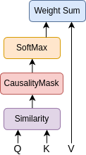
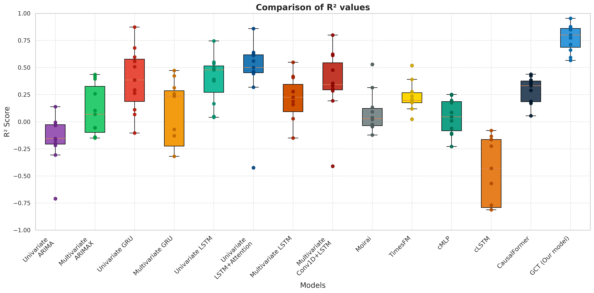
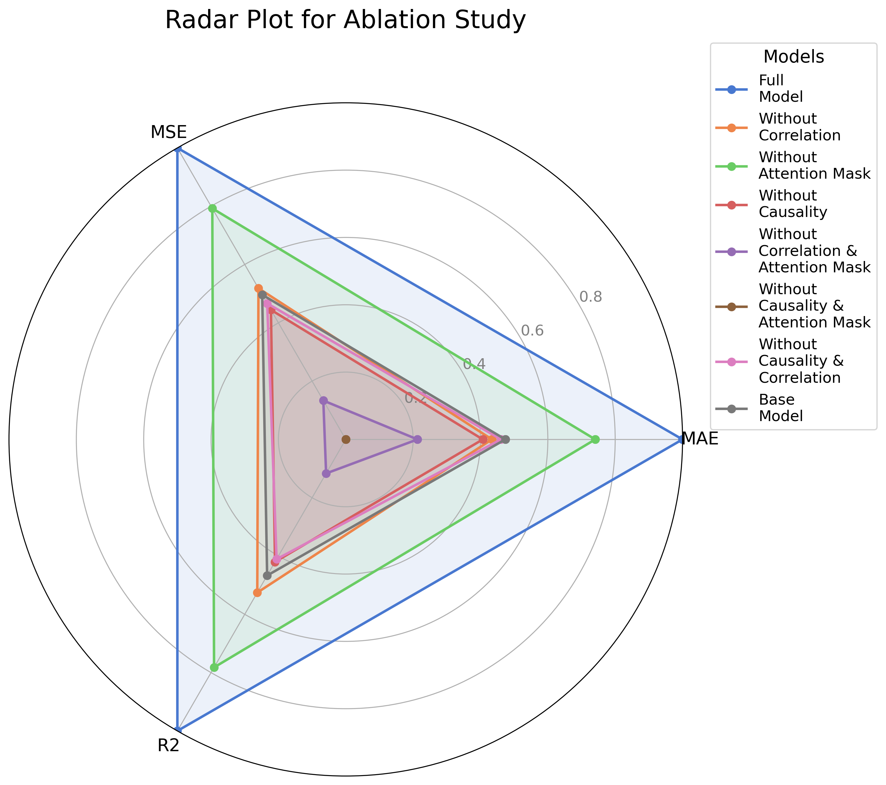

# Granger-Causal Transformer for Traffic Flow Forecasting in Smart Villages

[](https://creativecommons.org/licenses/by/4.0/)
[](https://dl.acm.org/doi/10.1145/3787462)

A time-series forecasting model that integrates **Granger causality analysis** with a **Transformer architecture** to predict weekly traffic flow in smart villages. The model fuses IoT vehicle-count data with Google Trends search indices, applying a dual statistical filter and a Granger causal attention mask.

---

## Architecture

<p align="center">
  
</p>

*Full GCT pipeline: IoT data fusion with Google Trends → semantic validation (BETO/BERT) → Granger + correlation feature selection → causal matrix construction → LSTM encoder → Causality-Gated Transformer → forecast.*

---

## Overview

Predicting traffic flow in rural smart villages is challenging due to limited sensor infrastructure and strong seasonal variability driven by tourism. GCT addresses this by:

1. **Fusing heterogeneous data** — Combines IoT vehicle-detection counts with Google Trends search interest as exogenous leading indicators (tourists search before travelling).
2. **Semantic validation** — Uses a language model (BETO for Spanish, BERT for English) to retain only semantically relevant search terms via cosine similarity with a reference string describing the study area.
3. **Granger causality filtering** — Applies the Granger causality F-test (p < 0.05) to lagged versions of each series, selecting only those that statistically precede changes in traffic volume.
4. **Correlation filtering** — Retains only features with absolute Pearson correlation > α with the target, reducing redundancy.
5. **Causal attention mask** — Constructs a Granger causal matrix *C* and applies it element-wise (Hadamard product) to attention scores **before** softmax, so causally related pairs receive boosted attention weights.

### Causal Attention Mechanism

<p align="center">
  
</p>

*Standard self-attention (left) vs. GCT causal attention (right): scores are multiplied by (1 + C) before softmax normalisation.*

The attention formula with causal mask (paper Eq. 4):

```math
\text{Attention}(Q,K,V) = \text{softmax}\!\left(\frac{QK^\top}{\sqrt{d_k}} \odot (1 + C)\right)V
```

where the causal matrix entry is:

```math
C_{ij} = \frac{1}{\text{best\_lag}(i,j)} \cdot \mathbb{I}(X_i \to X_j)
```

A shorter lag indicates a stronger causal effect, so the inverse-lag weighting amplifies attention between tightly coupled series.

---

## Study Area

The primary case study covers the **Alpujarra region** (Granada, Spain): three rural villages (Pampaneira, Bubión, Capileira) connected by a single access road and monitored by IoT ANPR cameras. A second generalisability study uses traffic data from **Salt Lake City, USA**.

---

## Results

**Rural case study** — 10-fold expanding-window cross-validation:

| Model | MAE ↓ | MSE ↓ | R² ↑ |
|---|---|---|---|
| ARIMA | 0.0982 ± 0.0143 | 0.0155 ± 0.0036 | −0.155 ± 0.234 |
| Univariate LSTM | 0.0684 ± 0.0134 | 0.0084 ± 0.0036 | 0.392 ± 0.233 |
| LSTM with Attention | 0.0627 ± 0.0217 | 0.0073 ± 0.0051 | 0.460 ± 0.342 |
| Causalformer | 0.0783 ± 0.0084 | 0.0101 ± 0.0018 | 0.289 ± 0.130 |
| **GCT (ours)** | **0.0438 ± 0.0143** | **0.0032 ± 0.0019** | **0.773 ± 0.132** |

GCT achieves **68% improvement in R²** and **56% reduction in MSE** vs. the second-best model.

### R² Score Distribution

<p align="center">
  
</p>

### Ablation Study

<p align="center">
  
</p>

| Configuration | MAE ↓ | MSE ↓ | R² ↑ |
|---|---|---|---|
| **Full model** | **0.0438** | **0.0032** | **0.773** |
| Without Causality filter | 0.0811 | 0.0107 | 0.206 |
| Without Correlation filter | 0.0794 | 0.0097 | 0.309 |
| Without Attention Mask | 0.0601 | 0.0060 | 0.560 |
| Base model (no filters, no mask) | 0.1012 | 0.0164 | −0.280 |

---

## Model Architecture

| Layer | Type | Parameters |
|---|---|---|
| 0 | Input (N\_batch, num\_variables) | N\_batch = 64 |
| 1 | LSTM | lstm\_units = 32 |
| 2 | LayerNormalization | — |
| 3 | Multi-Head Attention + Causal Mask | num\_heads = 4 |
| 4 | LayerNormalization | — |
| 5 | Add (residual) | — |
| 6 | Concatenate | — |
| 7 | Dense + ReLU | dense\_units = 64 |
| 8 | Dropout | rate = 0.15 |
| 9 | Dense + ReLU | dense\_units / 2 = 32 |
| 10 | Dense (output) | 1 scalar |

**Training:** Adam, lr = 1e-4, batch\_size = 64, epochs = 200.  
**Feature selection:** Granger p < 0.05, |Pearson corr| > 0.5, max\_lag = 12 weeks.

---

## Project Structure

```
├── configs/
│   └── config.yaml          # All hyperparameters
├── images/                  # Architecture and result figures
├── scripts/
│   └── run_experiment.sh    # Full pipeline runner
└── src/
    ├── model.py             # GCT PyTorch model (canonical implementation)
    ├── preprocessing.py     # Data loading and normalisation
    ├── granger_analysis.py  # Granger tests and causal matrix construction
    ├── training.py          # 10-fold CV loop, metrics, feature importance
    ├── ablation.py          # 8 ablation configurations
    ├── sensitivity.py       # Sensitivity analysis over τ and α thresholds
    └── __init__.py
```

---

## Data

Traffic counts from IoT ANPR cameras and Google Trends indices from the Alpujarra region (Granada, Spain). **Raw data is not included** — contact the authors for access.

---

## Quick Start

```bash
pip install -r requirements.txt

# Full GCT experiment (requires data in ./data/)
python -m src.model \
    --trends_file data/google_trends_data.csv \
    --plates_file data/unique_num_plate_count_per_week.csv

# Ablation study
python -m src.ablation \
    --trends_file data/google_trends_data.csv \
    --plates_file data/unique_num_plate_count_per_week.csv
```

---

## Citation

This repository is published under CC BY 4.0. If you use this code or build upon it, you **must** cite the paper:

```bibtex
@article{duran2026gct,
  title={GCT: a Granger-causal transformer for multivariate traffic analysis in smart villages},
  author={Dur{\'a}n-L{\'o}pez, Alberto and Bola{\~n}os-Martinez, Daniel and De, Suparna and Bermudez-Edo, Maria},
  journal={ACM Transactions on Intelligent Systems and Technology},
  volume={17},
  number={2},
  pages={1--25},
  year={2026},
  publisher={ACM New York, NY}
}
```

---

## License

[Creative Commons Attribution 4.0 International (CC BY 4.0)](https://creativecommons.org/licenses/by/4.0/) — Copyright © 2025 SmartPoqueira.

Free to use, adapt, and distribute for any purpose, including commercially, provided you **give appropriate credit and cite the paper above**.
