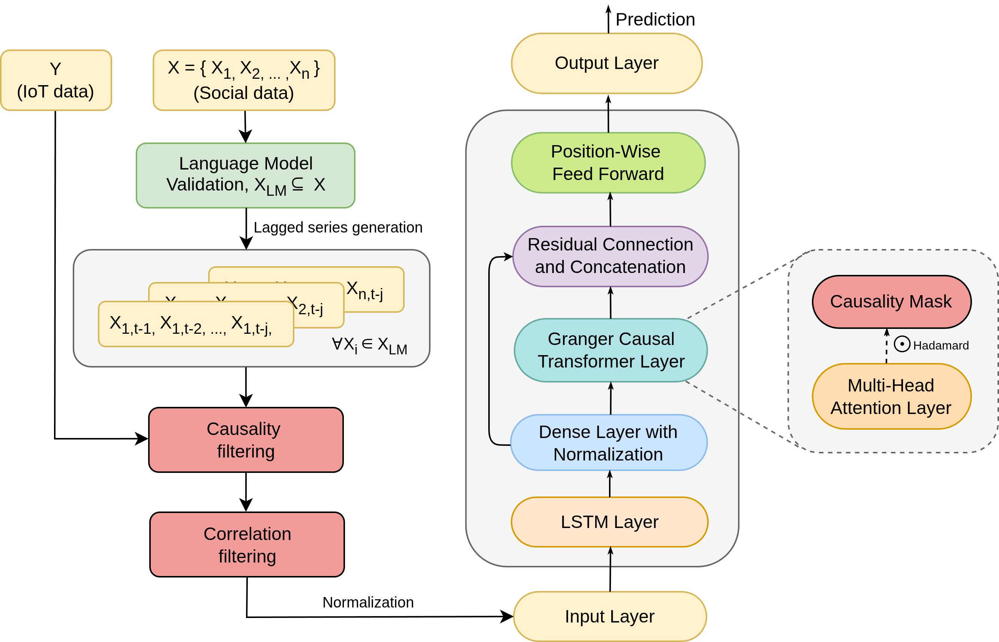
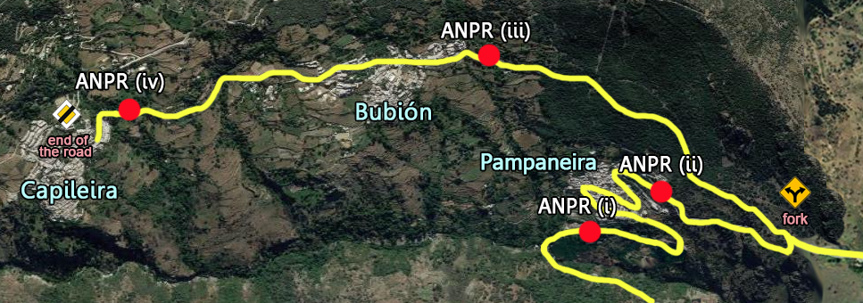

# Granger-Causal Transformer for Traffic Flow Forecasting in Smart Villages

[](https://creativecommons.org/licenses/by/4.0/)

A time-series forecasting model that integrates **Granger causality analysis** with a **Transformer architecture** to predict traffic flow in smart villages. The model uses Google Trends data as exogenous signals, applying EEMD denoising and a learned causality gate to weight feature contributions based on their causal relationship with the target variable.


## Architecture

<p align="center">
  
</p>

*Block diagram of the CGTST pipeline: data fusion → EEMD denoising → Granger causality analysis → causal matrix construction → Causality-Gated Transformer.*

## Overview

Predicting traffic flow in rural areas is challenging due to limited sensor infrastructure and seasonal variability. GCT addresses this by:

1. **Fusing heterogeneous data** — Combining IoT traffic counts with Google Trends search interest data.
2. **Granger causality filtering** — Identifying which external signals causally precede changes in traffic volume.
3. **Causal attention biasing** — Constructing a causality matrix $C_{ij} = \frac{1}{\text{best\_lag}} \cdot \mathbb{I}(X_i \to X_j)$ that modulates transformer attention weights via Hadamard product.
4. **EEMD denoising** — Ensemble Empirical Mode Decomposition removes high-frequency noise from all input signals.

### Causal Attention Mechanism

<p align="center">
  
</p>

*The causal attention layer modulates standard self-attention with the Granger causality matrix using `attention * (1 + α·C)`.*

## Study Area

<p align="center">
  
</p>

*Smart village IoT camera network in the Alpujarra region (Granada, Spain).*

## Results

Expanding-window cross-validation (10 folds):

| Model | MAE ↓ | MSE ↓ | R² ↑ |
|---|---|---|---|
| LSTM | 0.0847 | 0.0123 | 0.721 |
| Transformer (TST) | 0.0792 | 0.0108 | 0.755 |
| CGTST (no causality) | 0.0768 | 0.0101 | 0.771 |
| **CGTST (Granger)** | **0.0634** | **0.0072** | **0.836** |
| CGTST (Granger + Corr.) | 0.0651 | 0.0076 | 0.828 |

### R² Score Distribution

<p align="center">
  
</p>

## Project Structure

```
├── configs/
│   └── config.yaml
├── src/
│   ├── model.py              # CGTST model (TST + causality gate)
│   ├── granger_analysis.py   # Granger tests + causal matrix
│   └── __init__.py
├── paper/
│   ├── main.tex
│   ├── *.bib
│   └── figures/
└── scripts/
    └── run_experiment.sh
```

## Data

Traffic count data and Google Trends indices from the Alpujarra region (Granada, Spain). **Data is not included** — contact authors for access.

## Quick Start

```bash
pip install -r requirements.txt
python -m src.model --config configs/config.yaml
```

## Citation

```bibtex
@article{duran2026gct,
  title={GCT: a Granger-causal transformer for multivariate traffic analysis in smart villages},
  author={Dur{\'a}n-L{\'o}pez, Alberto and Bola{\~n}os-Martinez, Daniel and De, Suparna and Bermudez-Edo, Maria},
  journal={ACM Transactions on Intelligent Systems and Technology},
  volume={17},
  number={2},
  pages={1--25},
  year={2026},
  publisher={ACM New York, NY}
}
```

## License

MIT License — see [LICENSE](LICENSE).
